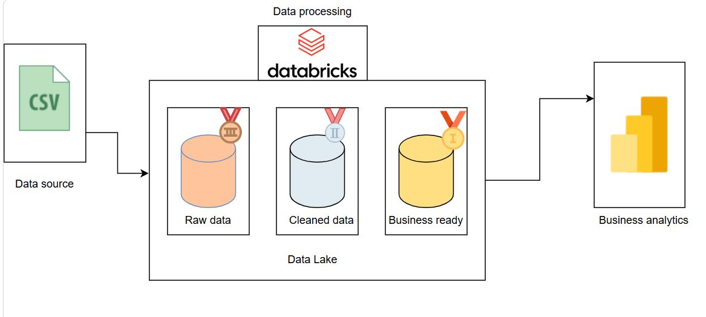

**📦 RetailLake Analytics E-Commerce Lakehouse Pipeline**
 End-to-End E-Commerce Lakehouse Analytics Pipeline using Databricks, PySpark, and Delta Lake


## ⚙️ Tech Stack

### Data Processing


### Data Platform


### Querying & Version Control


**🚀 Project Overview**

This end-to-end data engineering project simulates and processes e-commerce transactional data to generate meaningful business insights and analytics dashboards. We built a scalable data pipeline using Databricks, Apache Spark, and Delta Lake, following a Medallion Architecture (Bronze → Silver → Gold) to progressively transform raw data into analytics-ready datasets.

## 🏗️ End-to-End Pipeline Architecture

The following diagram illustrates the complete data flow and Medallion Architecture implementation used in this project:



## 📂 Project Structure

```text
E-com-Project/
│
├── notebooks/
│   ├── bronze/
│   ├── silver/
│   └── gold/
│
├── data/
│   └── raw/
│
├── sql/
│   ├── revenue_analysis.sql
│   ├── top_products.sql
│   ├── customer_spending.sql
│   ├── yearly_orders.sql
│   └── category_revenue.sql
│
├── dashboards/
│   └── dashboard_notes.md
│
├── architecture/
│   ├── architecture.md
│   └── pipeline_architecture.png.JPG
│
├── README.md
└── .gitignore
```

⚙️ Step 2: Data Processing in Databricks (Medallion Architecture)

We implemented a 3-layer Medallion Architecture using PySpark in Databricks to transform raw e-commerce data into analytics-ready datasets.

🍂 Bronze Layer (Raw Ingestion)

01_bronze_ingestion.py / notebook

We loaded raw e-commerce data (CSV / generated dataset) into Databricks and stored it in Delta format without applying any transformations. This layer preserves the original structure of the data for traceability and auditing purposes.

Output tables created:

bronze_customers
bronze_orders
bronze_products
bronze_payments
🔧 Silver Layer (Data Cleaning & Transformation)

02_silver_cleaning.py / notebook

In this layer, we cleaned and standardized the data by removing null values, duplicates, and inconsistent records. Data types such as dates and numeric fields were corrected, and datasets were joined where necessary (e.g., orders with customers and products).

Output tables created:

silver_customers
silver_orders
silver_products
🪙 Gold Layer (Business Aggregation)

03_gold_analytics.py / notebook

This layer focuses on business-level aggregations and KPI generation using PySpark. We built analytics-ready tables for reporting and dashboarding.

Key metrics include:

Total revenue by product
Orders by state
Customer spending behavior

Output tables created:

gold_revenue_metrics
gold_customer_analysis
gold_product_performance
🧾 Notebooks Structure
1_bronze_ingestion.ipynb
2_silver_cleaning.ipynb
3_gold_analytics.ipynb

All notebooks are version-controlled and pushed to GitHub via Databricks Repos.
```
cd notebooks

git add bronze/01_bronze_ingestion.py
cd ..
git commit -m "Bronze layer ingestion for e-commerce transactional data"

cd notebooks

git add silver/02_silver_cleaning.py
cd ..
git commit -m "Silver layer data cleaning and transformation for e-commerce datasets"

cd notebooks

git add gold/03_gold_analytics.py
cd ..
git commit -m "Gold layer business aggregations and KPI generation for analytics and reporting"
```
**
📊 Step 4: Power BI Dashboard**

📈 Visuals Created:
Visual Type	Description
| Visualization       | Purpose                               |
| ------------------- | ------------------------------------- |
| 📊 KPI Card         | Displays overall revenue generated    |
| 👥 KPI Card         | Shows total unique customers          |
| 📦 KPI Card         | Displays total number of orders       |
| 🛒 KPI Card         | Shows total items sold                |
| 📈 Line Chart       | Revenue trend over time               |
| 📊 Bar Chart        | Total revenue by category             |
| 📊 Column Chart     | Total revenue by product              |
| 🎛️ Category Slicer | Filters dashboard visuals by category |

